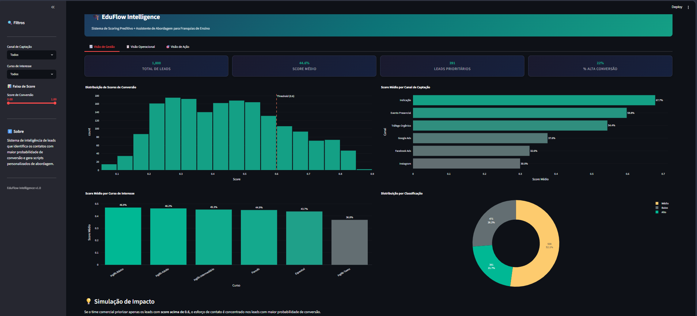
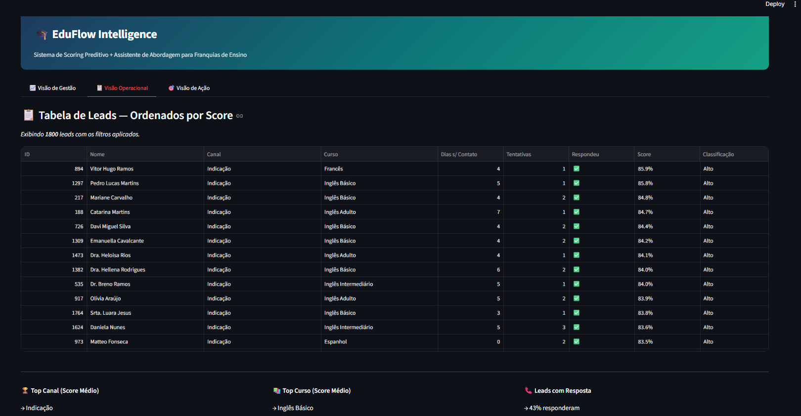
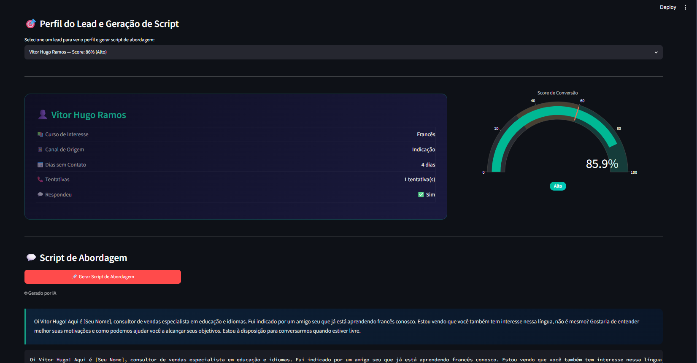

# EduFlow Intelligence
### Sistema de Scoring Preditivo de Leads com Assistente de Abordagem por IA Generativa

> Franquias de ensino convertem menos de 2% dos leads captados. O problema raramente é falta de contato — é falta de priorização e contexto. Este sistema resolve os dois.

---

## Demonstração

[](https://www.youtube.com/watch?v=SEU_VIDEO_ID)

> Clique na imagem para assistir à demonstração completa (2 min).

---

## Impacto Simulado

| Abordagem | Leads contatados | Matrículas estimadas | Taxa de conversão |
|---|---|---|---|
| Sem o sistema (contato aleatório) | 1.200 / mês | ~22 | 1,8% |
| Com o sistema (top 22% por score) | 264 / mês | ~19 | 7,3% |

**Mesma quantidade de matrículas. Um terço do esforço comercial.**

> Esses números são simulados com base nas distribuições do dataset gerado e no threshold de decisão do modelo final. O objetivo não é prometer resultado — é demonstrar como o sistema direciona esforço onde ele gera retorno.

---

## O Problema

O consultor de vendas chega na segunda-feira com 80 novos números para ligar. Quem ele prioriza? Na maioria das operações, a resposta é: _os que chegaram primeiro_. Sem critério, sem contexto, sem personalização.

Leads de indicação direta — que historicamente convertem 4× mais que leads de tráfego pago — entram na mesma fila. A janela de oportunidade de 48h fecha enquanto o time está ocupado com contatos frios.

O EduFlow Intelligence transforma o departamento comercial de **reativo** para **proativo guiado por dados**: o sistema diz _quem_ contatar, _por que_ aquele lead tem potencial e _como_ abordá-lo.

---

## A Solução em 3 Camadas

**1. Motor Preditivo (ML + SHAP)**
Modelo de classificação treinado sobre características do lead — canal de origem, histórico de contatos, curso de interesse, tempo de resposta — que gera uma probabilidade de conversão entre 0 e 1 para cada contato. O SHAP decompõe esse score em fatores concretos e legíveis.

**2. Backend de Alta Performance (FastAPI)**
API REST que serve os scores, as explicações SHAP e orquestra as chamadas ao LLM. Arquitetura separada do frontend por design — permite que o modelo seja atualizado ou substituído sem tocar na interface.

**3. Assistente de Abordagem por LLM (IA Generativa)**
Com o perfil do lead e as razões matemáticas do score em mãos, o sistema chama um LLM via OpenRouter para gerar um script de WhatsApp personalizado. Não é um template genérico — a mensagem menciona o curso certo, reconhece o canal de origem e usa o comportamento anterior do lead como argumento de abordagem.

---

## Interface

O dashboard é dividido em três visões com responsabilidades distintas.

### Visão de Gestão
KPIs agregados: distribuição de scores na base, taxa de conversão simulada por canal e volume de leads por período. Projetada para o gerente acompanhar a saúde do funil.



---

### Visão Operacional
Tabela de leads ordenada por probabilidade de conversão, com filtros por canal de origem, curso de interesse e faixa de score. O vendedor vê imediatamente quem contatar primeiro.



---

### Visão de Ação
Perfil completo do lead selecionado, explicação visual dos fatores SHAP que geraram o score e geração do script de abordagem via LLM com um clique.



---

## Contexto de Domínio

Este projeto não foi construído sobre suposições acadêmicas.

O design das features, a escolha das variáveis preditivas e a lógica de priorização partem de **6 anos de atuação operacional e comercial em franquia de ensino de idiomas** — incluindo gestão de campanhas de captação, acompanhamento do ciclo de matrícula e uso cotidiano de CRM.

Isso explica decisões que não aparecem em tutoriais: por que o canal de origem tem peso diferente dependendo da época do ano, por que leads de turno noturno têm perfil de conversão distinto, por que o número de tentativas anteriores é um sinal negativo a partir de certo ponto. Domínio de negócio não é documentação — é o que torna um modelo utilizável em produção.

---

## Jornada Técnica

### Etapa 1 — Dados Sintéticos com Realismo Estatístico

Dados reais de leads contêm informações sensíveis e não podem ser publicados. A solução foi construir um gerador de dados sintéticos que recria distribuições estatisticamente plausíveis do comportamento de leads brasileiros: desbalanceamento intencional (~7% de conversão), missing values em ~12% dos registros e correlações entre variáveis que refletem padrões reais do setor.

O script gerador é versionado e determinístico via seed fixo — qualquer pessoa que clonar o repositório reproduz exatamente o mesmo dataset.

**Stack:** `pandas`, `numpy`, `scipy.stats`, `Faker` (locale `pt_BR`)

---

### Etapa 2 — Pipeline de Pré-processamento sem Vazamento de Dados

O maior risco técnico em projetos de ML com dados mistos (numéricos + categóricos) é o _data leakage_: transformações aplicadas sobre o dataset completo antes da divisão treino/teste contaminam a avaliação do modelo com informação do futuro.

A solução foi encapsular todas as transformações em um `Pipeline` do scikit-learn com `ColumnTransformer`. O pipeline é fitado **apenas nos dados de treino** e aplicado nos dados de teste — garantindo que a avaliação reflita performance real em dados novos. O mesmo objeto serializado é carregado pela API em produção, eliminando discrepância entre treino e serviço.

**Stack:** `scikit-learn` (`Pipeline`, `ColumnTransformer`, `SimpleImputer`, `OneHotEncoder`, `StandardScaler`)

**Features de negócio criadas:**
- `score_engajamento` — combina velocidade de resposta, número de tentativas e interação prévia
- `is_indicacao` — flag binária que isola o canal de maior conversão histórica
- `urgencia_estimada` — produto entre dias sem contato e tentativas acumuladas

---

### Etapa 3 — Seleção de Modelo com Critério de Negócio

O desafio do desbalanceamento de classes: um modelo que prevê "não vai converter" para todos os leads obtém 93% de acurácia — e é completamente inútil. A métrica correta aqui é **AUC-ROC** combinada com **Average Precision**, que penalizam exatamente esse comportamento.

Três modelos foram comparados:

| Modelo | AUC-ROC | Average Precision | Interpretabilidade |
|---|---|---|---|
| Logistic Regression | ✦ mais alto | ✦ mais alto | Alta (coeficientes diretos) |
| Random Forest | intermediário | intermediário | Média (feature importance) |
| XGBoost | intermediário | intermediário | Média (SHAP necessário) |

**Decisão:** Regressão Logística apresentou melhor capacidade de separação e, para este problema específico, a interpretabilidade nativa é um ativo — o modelo precisa ser auditável pelo time comercial, não apenas pelo analista.

**Stack:** `scikit-learn`, `xgboost`, `joblib`

---

### Etapa 4 — Explicabilidade com SHAP

Um score de 78% sem contexto não muda o comportamento do vendedor. _"Maria tem 78% de chance porque foi uma indicação direta (+0,31) e respondeu na primeira tentativa (+0,18)"_ muda.

O SHAP (SHapley Additive exPlanations), fundamentado em Teoria dos Jogos, calcula a contribuição marginal de cada feature para cada predição individual. O resultado é injetado diretamente no prompt do LLM na etapa seguinte — o assistente de abordagem não recebe apenas o score, recebe os **argumentos matemáticos** por trás dele.

**Stack:** `shap` (`LinearExplainer`, waterfall plots, beeswarm plots)

---

### Etapa 5 — Backend REST e Integração com LLM

A API expõe três endpoints:

- `GET /leads` — retorna a tabela de leads com scores e features SHAP calculados
- `POST /score` — recebe perfil de lead novo, retorna probabilidade + explicação
- `POST /script` — monta contexto com perfil + score + SHAP + chama LLM, retorna script de abordagem

O prompt enviado ao LLM é externalizado em `prompts/script_template.txt` — separado do código Python por decisão de arquitetura. Prompts são peças de engenharia que precisam ser versionadas, testadas e iteradas independentemente da lógica da aplicação.

**Stack:** `FastAPI`, `uvicorn`, `pydantic`, `python-dotenv`, `httpx`
**LLM:** OpenRouter API (Mistral Nemo) — configurável via `.env`, não acoplado ao provedor

---

## Estrutura do Repositório

```
eduflow-intelligence/
│
├── assets/
│   ├── thumb_demo.png              # Thumbnail clicável do vídeo de demonstração
│   └── screenshots/
│       ├── visao_gestao.png        # Dashboard — KPIs e distribuição de scores
│       ├── visao_operacional.png   # Dashboard — tabela de leads por score
│       └── visao_acao.png          # Dashboard — perfil, SHAP e script gerado
│
├── src/
│   ├── data_generation.py          # Gerador de dataset sintético (seed fixo)
│   ├── preprocessing.py            # ColumnTransformer e features de negócio
│   ├── model_training.py           # Treino, comparação e serialização do modelo
│   └── model_evaluation.py         # Métricas, curvas e simulação de impacto
│
├── api/
│   └── main.py                     # FastAPI: /leads, /score, /script
│
├── dashboard/
│   └── app.py                      # Streamlit: 3 visões (gestão, operacional, ação)
│
├── prompts/
│   └── script_template.txt         # Template do prompt LLM (versionado separadamente)
│
├── notebooks/
│   ├── eda.ipynb                   # Análise exploratória com narrativa de negócio
│   └── model_evaluation.ipynb      # Avaliação de modelos e simulação de impacto
│
├── model.pkl                       # Pipeline serializado (preprocessamento + modelo)
├── leads_raw.csv                   # Dataset gerado (reproduzível via data_generation.py)
├── .env.example                    # Variáveis de ambiente necessárias (sem valores reais)
├── requirements.txt
└── README.md
```

---

## Stack Tecnológico

| Camada | Tecnologia | Por que esta escolha |
|---|---|---|
| Linguagem | Python 3.10+ | Padrão do mercado para DS/ML |
| ML & Pipeline | scikit-learn, XGBoost | Pipeline serializado evita data leakage em produção |
| Explicabilidade | SHAP | Padrão corporativo para auditabilidade de modelos |
| IA Generativa | OpenRouter (Mistral Nemo) | Agnóstico a provedor, configurável via `.env` |
| Backend | FastAPI + Uvicorn | Validação automática via Pydantic, Swagger nativo |
| Frontend | Streamlit + Plotly | Padrão para dashboards analíticos em Python |
| Dados | pandas, numpy, scipy, Faker | Geração estatisticamente plausível com locale BR |

---

## Como Executar Localmente

**1. Clone e acesse o projeto:**
```bash
git clone https://github.com/SeuUsuario/eduflow-intelligence.git
cd eduflow-intelligence
```

**2. Ambiente virtual e dependências:**
```bash
python -m venv .venv

# Windows
.\.venv\Scripts\activate
# Mac/Linux
source .venv/bin/activate

pip install -r requirements.txt
```

**3. Variáveis de ambiente:**
```bash
cp .env.example .env
# Edite o .env e insira sua chave OpenRouter
```

**4. Gere os dados e treine o modelo:**
```bash
python src/data_generation.py
python src/model_training.py
```

**5. Inicie o backend (mantenha este terminal aberto):**
```bash
python -m uvicorn api.main:app --host 0.0.0.0 --port 8000
```

**6. Inicie o dashboard (novo terminal, mesmo ambiente virtual):**
```bash
python -m streamlit run dashboard/app.py
```

Acesse `http://localhost:8501` — o dashboard conecta automaticamente à API.

---

## Autor

Construído por alguém que viveu o problema antes de modelá-lo.

Se quiser conversar sobre o projeto, dados, ou como adaptar o sistema para outros contextos de negócio — me encontra no [LinkedIn](#).
